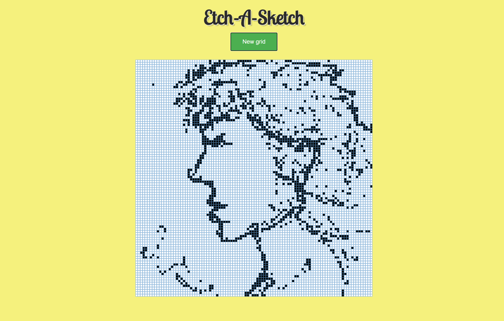
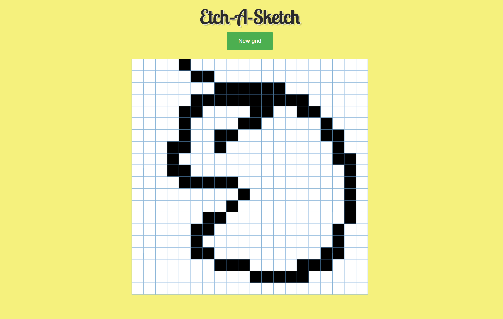

# Etch-A-Sketch

A sketching game where the user can paint on a grid canvas by dragging the mouse across its squares. 
In addition, there is a button that changes the size of the grid (1-100) through user input.

### Learning Outcomes
Through this project, I gained a deeper understanding of JavaScript, specifically, adding event listeners and
manipulation of HTML through JavaScript.

### Demo

Grid size of 100x100

Grid size of 20x20

